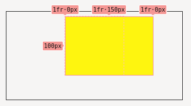
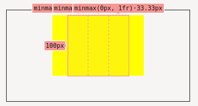

**TLDR;** Use `minmax(0, 1fr)` in your `grid-template-columns` styles to prevent
the expansion of grid columns.

## What's the problem?

When a child of a grid element expands past the fractional width of its
containing columns, the columns expand to match the width of the child element.

## Why's that an issue?

It's sometimes desirable for child of a grid to expand past the constraints of
the grid, a common case for this is a full-width image within the body of an
article. The article body will have a `max-width` to prevent the line-length
growing too large but the image needs to expand past that `max-width` to the
edges of the viewport with a width of `100vw`.

Grids with fractional column widths expand to the width of the child element
when the child has a specified width, in this case the `100vw` width image
expands the column to match `100vw` resulting in the image extending beyond the
viewpoint and causing overflow scrolling.

## Exploitation of the issue

Below you can see an example of the issue. The parent container (depicted here
by the dotted lines) has a `max-width` of `100px` and a three column grid with
each column having a width of `1fr` or `33.33px`.



A child element is positioned in the central column `2/3` and has a width larger
than the containing element's `max-width`.

The first and last columns collapse to `0` while the central column expands to
match the width of the child element.

## The solution

To prevent the parent grid columns growing past their original equal `1fr`
widths a constraint is needed in the form of the [`minmax`][minmax] function. By
setting each column to have a width `minmax(0, 1fr)` ensures they will grow in
width to a maximum of `1fr` and no more, preventing the expansion issue.

```CSS
#parent {
	grid-template-columns: repeat(3, minmax(0, 1fr));
}
```



## Addendum

The grid column behaviour documented above has been standard in Firefox for
while now but only recently appeared in Chrome due to a change in version 93
which is catching some people off-guard. There is a
[Chromium bug ticket][bug-tracker] tracking the _issue_ and a solution is
currently being investigated (as of 2021/09/13).

[minmax]: https://developer.mozilla.org/en-US/docs/Web/CSS/minmax()
[bug-tracker]: https://bugs.chromium.org/p/chromium/issues/detail?id=1247594
