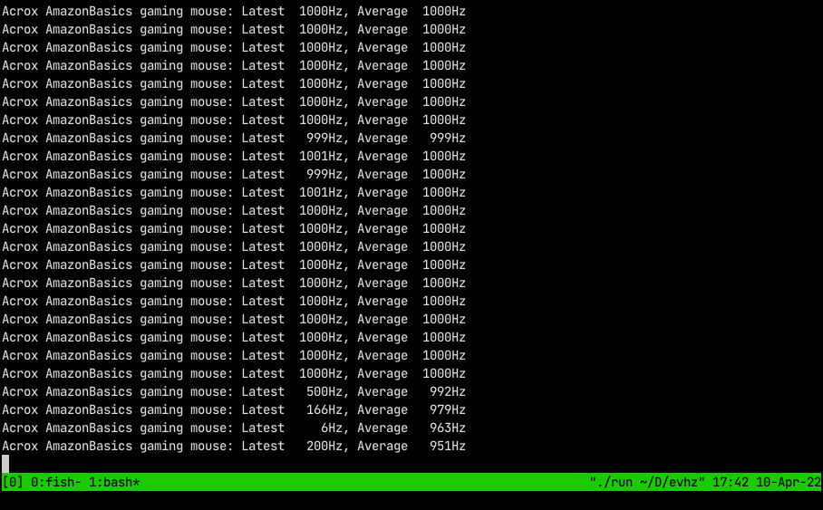
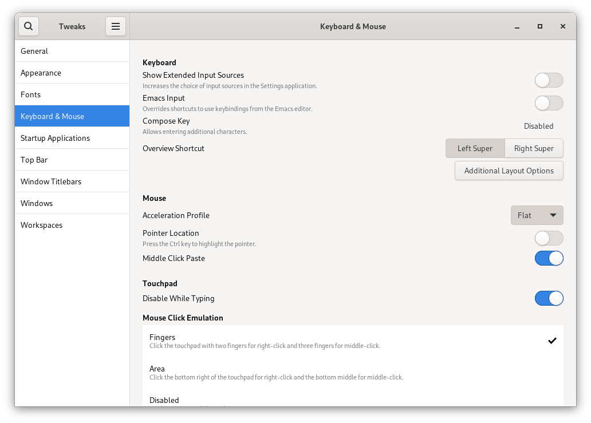

Recently, I purchased a wireless mouse that just didn't feel right on screen,
the pointer felt both too fast and sluggish at the same time.

My first port-of-call as with all Linux issues is the [Arch wiki][arch-wiki]
where I learnt about Mouse polling rates, the rate at which the OS asks the
Mouse for its position.

Using the great little utility [evhz][evhz] I was able to determine the new
mouse had a polling rate of 125hz, which when used on my 165hz display resulted
in the sluggish behaviour I was experiencing.

By switching to a cheaper wired gaming mouse spec'ed at up to 1000hz, I could
increase the polling rate to 500hz, but what was happing to the other 500hz? The
[Arch wiki][arch-wiki] had the answer, a known kernel bug that can cause polling
rates to be halved. The solution was to bypass the monitor's USB hub and plug
the mouse directly into a USB port on the motherboard. With the USB hub
bypassed, I was able to reach the full 1000hz polling rate and a smooth mouse
motion on screen.

One final improvement and one of personal preference is to disable mouse
smoothing on Gnome. There is an option in the [Gnome Tweaks][tweaks] tool to
customize the "Acceleration Profile" which defaults to "Default" (smoothing).
Changing the profile to "Flat" removes mouse smoothing.

[arch-wiki]: https://wiki.archlinux.org/title/Mouse_polling_rate
[evhz]: https://git.sr.ht/~iank/evhz
[tweaks]: https://wiki.gnome.org/Apps/Tweaks
